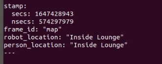
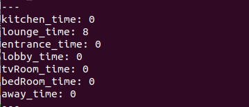
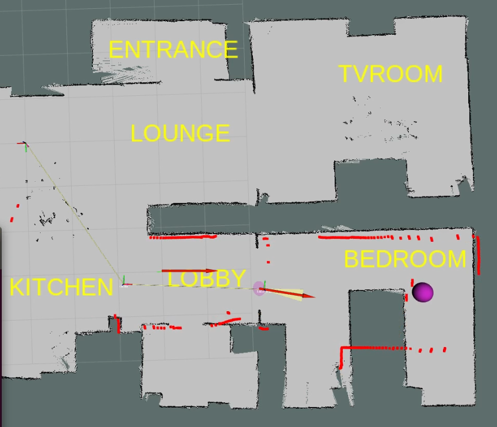

  
# Rehab Robot Person Location & Time Tracking


## Overview
This package contains nodes which track the person location & the time spent in the living lab map area. This package has been tested with the actual robot running navigation and person tracking AI model. Also, the same package has been tested in simulation which is described [here](https://github.com/Xavorcorp/Embd_MRR-Simulation.git). Also, this package contains a node which publishes the text labels to be overlayed on the living lab map in [RVIZ](http://wiki.ros.org/rviz). The below described information is provided according to the testing done on actual robot running navigation & AI models. 

## Pre-Requisites

1. This package is tested with ROS Melodic so preferably use the package with same ROS version.
2. This package depends highly on the navigation stack & AI model which finds the person in the camera frame and publishes its location on a ROS topic. Follow these [instructions](https://github.com/zeeshan-sardar/ros_ai_integration) for setting up the AI model on the robot, moreover for running the navigation on the robot, follow instructions [here]().


## Setup 

After following the step 2 in the pre-requisites, you must have the following in working:

* Robot must be running navigation. Verify that the topic ```/amcl_pose``` is being published by the navigation stack & the robot is able to navigate by accepting goal from *RVIZ*.
* The AI model is running correctly and the person location is being published on rostopic ```/person_loc``` in camera frame. 
* Make sure that the complete transform of the robot is being published correctly on ```/tf``` topic. 


## Usage 
After following the above setup process, run the following nodes: 

1. Run the following node
   
   ```bash 
   rosrun rehab_person_loc publish_text_marker_act
   ``` 
   to display the markers on the living lab map. These markers locations are hardcoded in the code. To modify the location of any marker, edit the respective marker location in ```publish_text_marker_act.cpp``` file. The map in the RVIZ should look similar to the one shown below after adding the relevant marker topics.  

   

2. Run the following to run the main node.,
   
   ```bash 
   rosrun rehab_person_loc getTime_act
   ```
   

   ### Subsribed Topics: 
   1. ```amcl_pose``` (geometry_msgs/PoseWithCovarianceStamped)
   
         Pose of the robot in the MAP frame.

   2. ```person_loc``` (geometry_msgs/PointStamped)

         Location of person in camera frame.
   
   ### Published Topics
   1. ```person_loc_estimated``` (geometry_msgs/PointStamped) 
   
         Computed location of person in MAP frame

   2. ```location_tag```(rehab_person_loc/location_info)
   
         Location of the robot and person in MAP.

   3. ```time_info```(rehab_person_loc/time_info) 
      
         The duration the person spents @ various locations in the tagged area in MAP. 


   ### Messages
   1.  ```location_tag.msg```

   ```bash
   time stamp
   string frame_id
   string robot_location
   string person_location
   ``` 

   2. ```time_info.msg```

   ```bash
   int32 kitchen_time
   int32 lounge_time
   int32 entrance_time
   int32 lobby_time
   int32 tvRoom_time
   int32 bedRoom_time
   int32 away_time
   ```


## Output
Check the below two published topics for the output shown below: 

* The topic ```location_tag``` will show the person and robot location in the MAP frame. Ouput will be like the one shown below. 
  
  

* The topic ```time_info``` will show the duration (in seconds) the person spends at various locations inside the MAP. Ouput will be like the one shown below. 

  

* Add the topic ```person_loc_estimated``` to *RVIZ* for visualizing the location of the person inside the MAP. The output will be like the one shown below (person location shown as purple colored marker on the MAP)
  
  

* The package also logs the person and robot location data along with the system clock time stamps in a text file. The log file is stored in ```rehab_person_loc/logs``` folder with the name ```rehab_person_loc.txt```. Sample file can be checked [here](rehab_person_loc/../logs/rehab_person_loc.txt) 


___
<br></br>

## Contact
**Author:** Ali Ahmad  <br/>
**Designation:** Senior Robotics Engineer <br/>
**Email:** ali.ahmad@xavor.com <br/>
